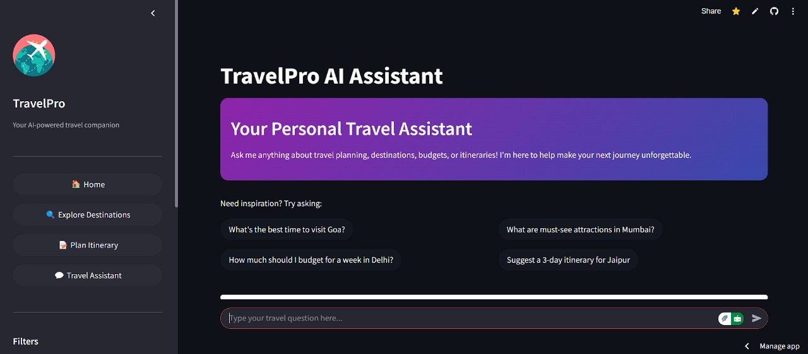
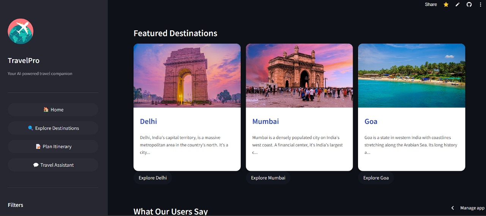

<div align="center">
  
  
  # 🌟 TravelPro - AI-Powered Travel Planning Platform
  
  [](https://github.com/Universe7Nandu/TravelPro/stargazers)
  [](https://twitter.com/UniverseMath25)
  [](https://www.linkedin.com/in/nandesh-kalashetti-333a78250/)
  [](https://www.instagram.com/nandesh_kalshetti/)

  ### 🚀 Experience the Future of Travel Planning
  [Watch Demo Video](https://youtu.be/yog_ib3aPNA) | [Live Demo](https://travelpro.streamlit.app/) | [Portfolio](https://nandeshkalashetti.netlify.app/)
</div>

## 🎯 Project Overview

TravelPro revolutionizes travel planning by combining AI with intuitive design. Built with Streamlit and powered by advanced AI models, it offers a seamless experience for creating personalized travel itineraries.

### ✨ Key Features

- 🤖 **AI Travel Assistant** - Get instant, personalized travel recommendations
- 📍 **Smart Destination Search** - Find perfect destinations matching your preferences
- 📝 **Dynamic Itinerary Generation** - Create detailed day-by-day travel plans
- 💡 **Intelligent Suggestions** - Receive smart recommendations for activities and attractions
- 📱 **Modern UI/UX** - Beautiful, responsive interface with dark mode support
- 📄 **PDF Export** - Download your itineraries in professionally formatted PDFs

## 🛠️ Tech Stack

- **Frontend:** Streamlit
- **AI/ML:** LangChain, Groq API, HuggingFace
- **Database:** ChromaDB
- **PDF Generation:** ReportLab
- **Styling:** Custom CSS, HTML

## 🚀 Getting Started

```bash
# Clone the repository
git clone https://github.com/your-username/TravelPro.git

# Navigate to project directory
cd TravelPro

# Install dependencies
pip install -r requirements.txt

# Run the application
streamlit run app.py
```

## 📸 Screenshots

<div align="center">
  
  
</div>

## 🎥 Demo Video

[](YOUR_YOUTUBE_LINK_HERE)

Check out the full demo video to see TravelPro in action! 🎬

## 🌟 Features in Detail

### 1. Smart Search & Discovery
- 🔍 Advanced destination search with filters
- 🎯 Personalized recommendations
- 📊 Budget estimation and planning

### 2. AI Travel Assistant
- 💬 Natural language interaction
- 🧠 Context-aware responses
- 🎯 Personalized suggestions

### 3. Itinerary Generation
- 📅 Day-by-day planning
- 🎨 Beautiful PDF exports
- 🔄 Real-time customization

## 🛣️ Roadmap

- [ ] Multi-language support
- [ ] Mobile app development
- [ ] Integration with booking platforms
- [ ] Weather forecasting
- [ ] Social sharing features

## 👨‍💻 About the Developer

<div align="center">
  
  
  ### Nandesh Kalashetti
  Full Stack Developer | AI Enthusiast | Travel Tech Innovator
  
  [Portfolio](https://nandeshkalashetti.netlify.app/) | [GitHub](https://github.com/Universe7Nandu) | [LinkedIn](https://www.linkedin.com/in/nandesh-kalashetti-333a78250/) | [Twitter](https://twitter.com/UniverseMath25) | [Instagram](https://www.instagram.com/nandesh_kalshetti/)
</div>

## 🤝 Contributing

Contributions are welcome! Please feel free to submit a Pull Request.

## 🌟 Show your support

Give a ⭐️ if this project helped you!

<div align="center">
  <p>Follow me for more amazing projects!</p>
  
  [](https://twitter.com/UniverseMath25)
  [](https://github.com/Universe7Nandu)
  [](https://www.linkedin.com/in/nandesh-kalashetti-333a78250/)
  [](https://www.instagram.com/nandesh_kalshetti/)
</div>

---
<div align="center">
  Made with ❤️ by <a href="https://nandeshkalashetti.netlify.app/">Nandesh Kalashetti</a>
</div> 
